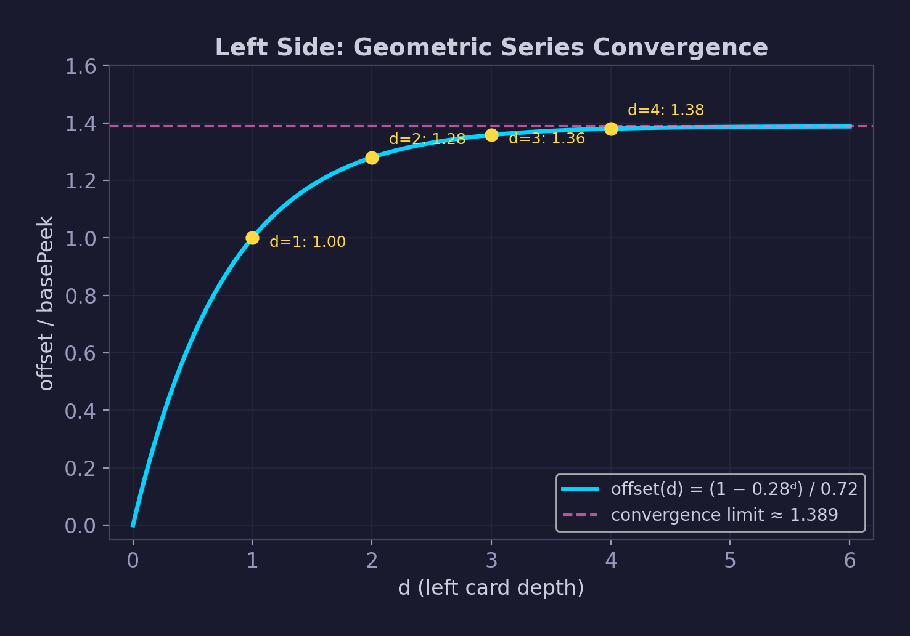
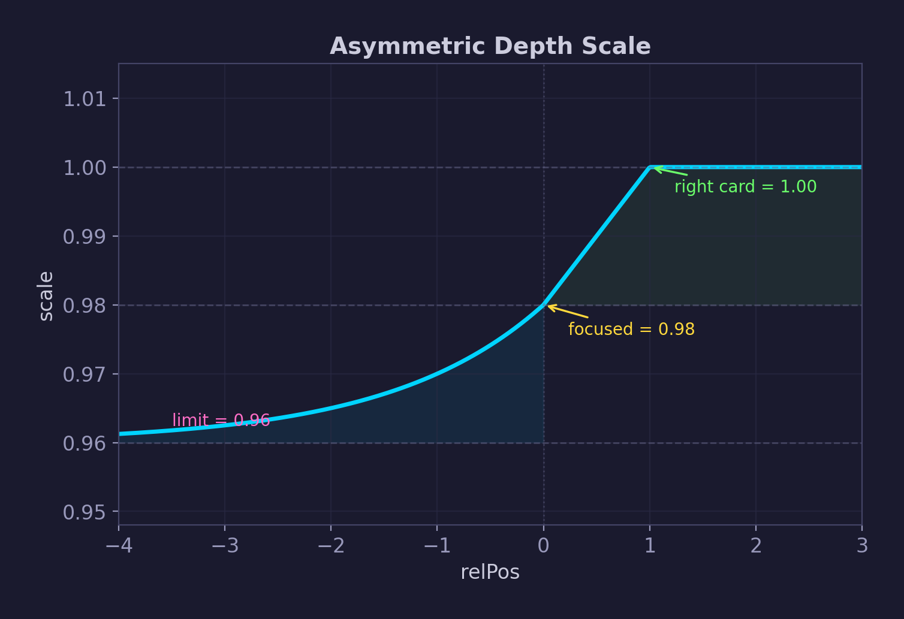
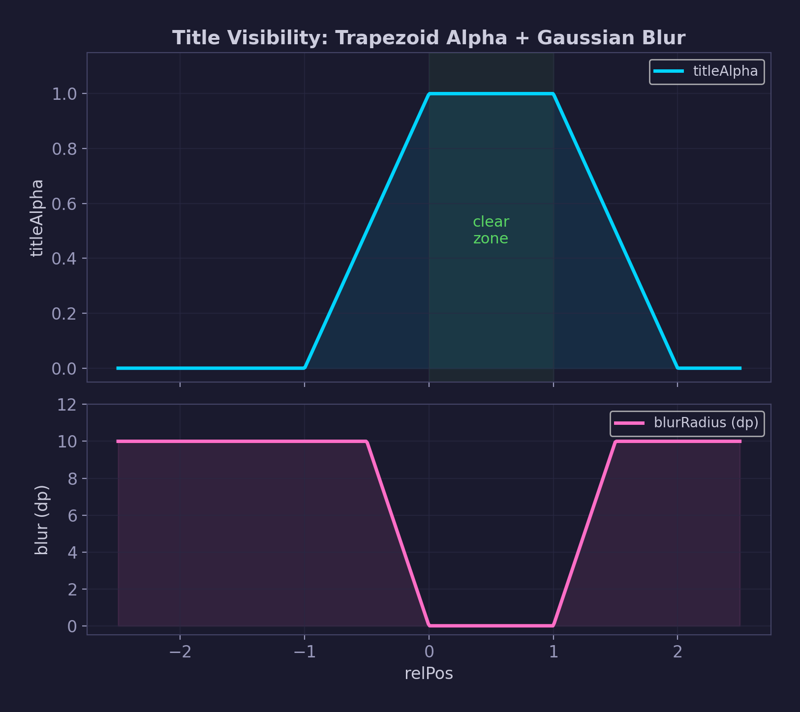
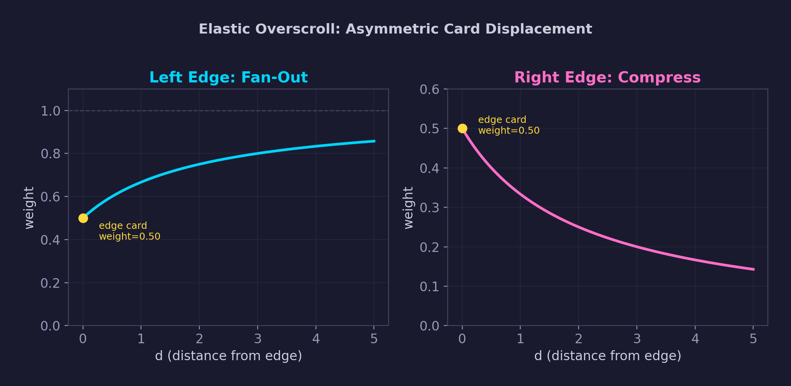
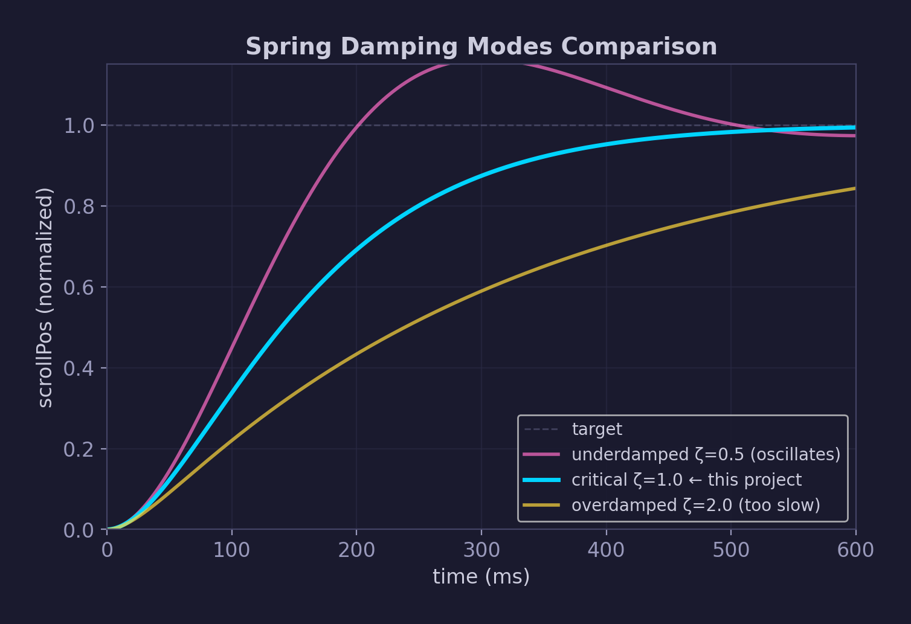
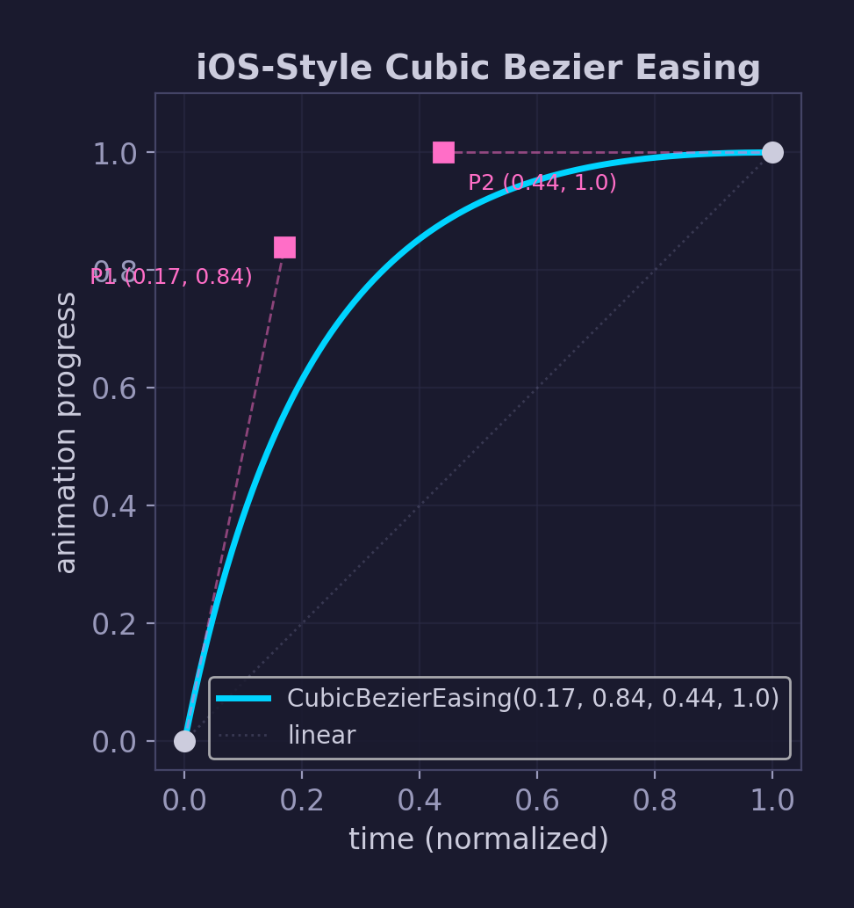

# AppSwitcherOverlay：物理与数学模型

iOS 风格应用切换器在 Jetpack Compose 中的数学建模与物理仿真全解析。

---

## 1. 状态空间

整个布局由单一连续标量 **scrollPos ∈ ℝ** 驱动。每张卡片的相对位置 `relPos(i) = i - clamp(scrollPos, 0, N-1)` 决定了其全部视觉属性：水平坐标、深度缩放、Z 轴层级、标题透明度、标题模糊度、暗色遮罩。

---

## 2. 非对称卡片定位

### 2.1 左侧：收敛几何级数

左侧卡片使用几何级数堆叠，级数收敛于有限极限。累计偏移量（深度 `d = -relPos`）：

```
offset(d) = basePeek × (1 - decay^d) / (1 - decay)
```

其中 `basePeek = cardWidth × 0.22`，`decay = 0.28`。

收敛极限 `offset(∞) = basePeek / (1 - decay) ≈ 0.306 × cardWidth`，即无论堆叠多少张卡片，左侧永远不会超出约 30.6% 的卡片宽度。实际上仅 ~2 张左卡肉眼可区分。



### 2.2 右侧：幂律视差

右侧使用非线性幂函数 `x(i) = centerX + relPos^1.2 × rightSpacing`（`rightSpacing = cardWidth × 0.85`）。

`relPos^1.2` 在 `relPos=1`（静止位）处值不变（`1^1.2 = 1`），但导数为 1.2 — 右卡移动速度比线性快 **20%**。超过 `relPos=1` 后加速更快，产生 iOS 特有的视差感。

---

## 3. 深度缩放



- 右侧线性爬升：`scale = min(0.98 + 0.02 × relPos, 1.0)`
- 左侧指数衰减：`scale = 0.96 + 0.02 × 0.50^(-relPos)`，半衰期 = 1 张卡
- 全量程仅 **2% 变化**（0.96–0.98→1.00），匹配 iOS 几乎不可察觉的尺寸差异

---

## 4. 标题可见性：梯形透明度 + 高斯模糊

```
titleAlpha = clamp(min(1 + relPos, 2 - relPos), 0, 1)
blurRadius = min(1 - titleAlpha, 0.5) × 20dp
```



标题在 `relPos ∈ [0, 1]`（主卡和静止位右卡）完全清晰。向两侧滑出时同步淡出 + 高斯模糊（上限 10dp）。

暗色深度遮罩仅作用于左卡：`overlayAlpha = clamp(-relPos × 0.25, 0, 0.50)`。

---

## 5. 拖拽物理与双层摩擦

像素→索引转换：`delta_index = -delta_pixel / (cardWidth × 0.60)`。

双层摩擦模型：基础摩擦 0.70（正常区域手指利用率 70%），边缘追加 0.30（过拉区域合成利用率仅 21%），产生 iOS 橡皮筋阻尼感。

---

## 6. 弹性过拉：非均匀位移

过拉时位移非均匀分配，替代刚性整体平移：

```
x_final(i) = x_base(i) - overscroll × rightSpacing × weight(i)
```



左边界拉过时（扇形展开）：`weight = (d+1)/(d+2)`，边缘卡仅半量位移，远端卡接近全量。
右边界拉过时（压缩挤压）：`weight = 1/(d+2)`，边缘卡半量位移，远端卡趋近零。

---

## 7. 惯性滚动

手指释放后，速度投影确定目标：`target = round(scrollPos + velocity × 0.25)`。仅 25% 动能转为位移，防止过冲。

弹簧动画 `Spring(dampingRatio = 1.0, stiffness = 80)` 驱动减速：



临界阻尼（ζ = 1.0）= 最快收敛且无振荡。低刚度 80（vs 默认 1500）使减速过程缓慢飘停，匹配 iOS 质感。

---

## 8. 卡片 ↔ 全屏过渡

两种动画（打开 Shrink-in / 关闭 Expand-out）共享统一进度 `p ∈ [0, 1]`，线性插值宽度、高度、位置、圆角（30dp → 0dp）。



`CubicBezierEasing(0.17, 0.84, 0.44, 1.0)` — 温和启动、快速达峰、长尾减速、无过冲。动画时长 400ms。

---

## 9. Z 轴层级 & 性能优化

**Z 轴**：卡片按索引递增（右侧始终在上），过渡遮罩在最上层，手势层 `z = Float.MAX_VALUE`。

**性能优化**：
- 离屏裁剪：20 张卡片中通常仅 3–5 张需要渲染
- `derivedStateOf`：拖拽时忽略动画状态变化，反之亦然
- 形状常量提升：`RoundedCornerShape(30.dp)` 提升为顶层 `val`
- `key(stableKey)` 组合键：高效复用和重排 Compose 节点

---

## 参数总览

| 参数 | 值 | 物理含义 |
|------|------|------|
| 卡片宽度 | 屏幕宽 × 66% | 主卡尺寸 |
| 卡片圆角 | 30 dp | iOS 风格圆角 |
| 左侧 basePeek | cardWidth × 22% | 第一张左卡可见条宽 |
| 左侧 decay | 0.28 | 几何级数比率（~2 张可见） |
| 右侧间距 | cardWidth × 85% | 右卡基础距离 |
| 右侧视差指数 | 1.2 | 右卡比主卡快 20% |
| 主卡缩放 | 0.98 | 主卡略小于右卡 |
| 右卡缩放 | 1.00 | 全尺寸 |
| 左卡最小缩放 | 0.96 | 最深左卡的缩放极限 |
| 左卡缩放衰减 | 0.50 | 半衰期 = 1 张卡 |
| 暗色遮罩 | 0.25/relPos，上限 0.50 | 左卡阴影深度 |
| 拖拽灵敏度 | cardWidth × 60% | 拖多远 = 滑 1 张卡 |
| 基础摩擦 | 0.70 | 手指利用率 70% |
| 边缘摩擦 | 0.30 | 过拉合成利用率 21% |
| 惯性投影 | 0.25 | 速度→距离转化率 |
| 弹簧阻尼比 | 1.0 | 临界阻尼（无振荡） |
| 弹簧刚度 | 80 | 缓慢飘停 |
| 动画时长 | 400 ms | Shrink / Expand |
| 贝塞尔曲线 | (0.17, 0.84, 0.44, 1.0) | iOS 风格缓动 |
| 标题模糊上限 | 10 dp | 最大高斯模糊半径 |
| 背景不透明度 | 0.92 | 切换器遮罩亮度 |
| 左过拉权重 | (d+1)/(d+2) | 扇形展开 |
| 右过拉权重 | 1/(d+2) | 压缩挤压 |
